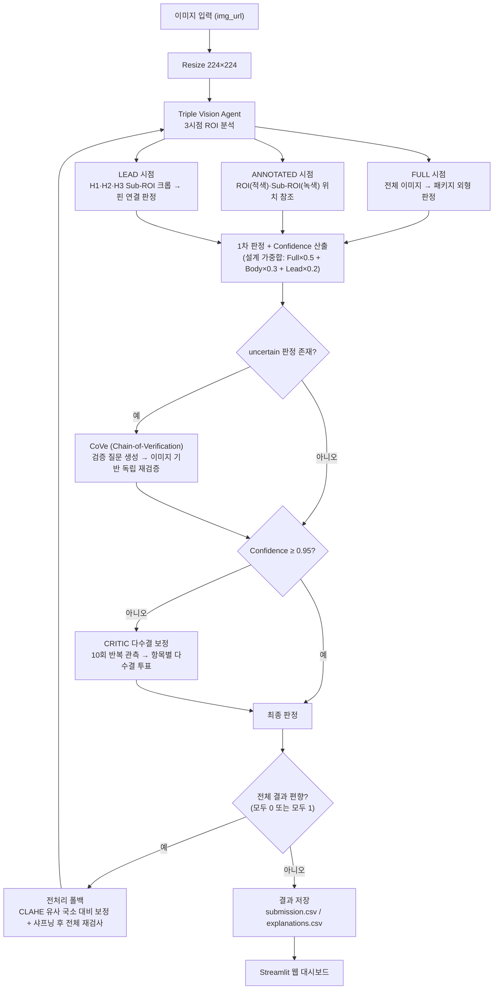

# 멀티모달 기반 제조 공정 진단 AI Agent


반도체 소자 외관 이미지를 GPT 비전(Vision) 모델로 분석하여 **정상(0) / 불량(1)** 을 자동 판정하는 멀티모달 AI Agent 시스템입니다.
단순한 단발성 판정이 아니라, **다중 시점 ROI 분석 → 신뢰도 기반 자기검증(CoVe) → 다수결 보정(CRITIC)** 으로 이어지는
자기검증형 파이프라인과 Streamlit 운영 대시보드를 엔드-투-엔드로 제공합니다.

**라이브 데모**: https://aiagent-qddtpkxykw7ccexdxveke2.streamlit.app/

---

## 판정 목표

| 항목 | 내용 |
|------|------|
| 입력 | 반도체 소자 이미지 (`test.csv`의 `id`, `img_url`) |
| 판정 결과 | `0` = 정상 (Normal), `1` = 불량 (Abnormal) |
| 불량 유형 | 패키지 외형 파손(칩핑·크랙·모서리 손상), H1·H2·H3 리드(핀) 단선 |
| 출력 | `submission.csv`(판정) + `explanations.csv`(판독 근거·신뢰도·투표 분포·ROI 메타) |

**판정 규칙**: 패키지 손상(`package_intact = false`) **또는** H1~H3 중 하나라도 `not_connected`이면 불량(1).

---

## 핵심 설계 (Self-Verifying Vision Pipeline)



### 1. Triple Vision Agent — 3시점 ROI 분석
한 장의 이미지를 5개 입력(FULL 원본, ROI 주석 이미지, H1~H3 Sub-ROI 크롭)으로 분해해 LLM에 동시 전달합니다.
- **패키지 손상**은 FULL 이미지로만 판정 (Sub-ROI 사용 금지 규칙을 프롬프트에 명시)
- **리드 연결**은 "12시 방향 접촉 + 갭 부재"라는 엄격한 정의로 `connected / not_connected / uncertain` 3분류
- ROI·Sub-ROI는 비율 기반 고정 좌표로 계산되어 LLM ROI 검출 실패 시에도 안정적으로 동작

### 2. 신뢰도 기반 자기검증 — CoVe + CRITIC
- **CoVe (Chain-of-Verification)**: `uncertain` 판정 발생 시, 초안 판정에 대한 검증 질문 체크리스트를 LLM이 스스로 생성하고, 초안에 앵커링되지 않도록 이미지 근거만으로 독립 재판정
- **CRITIC (다수결 보정)**: Confidence가 임계값(0.95) 미만이면 동일 이미지를 10회 반복 관측하여 패키지·홀별 상태를 항목별 다수결로 확정 (투표 분포는 `explanations.csv`에 기록)

### 3. 전처리 폴백 — CLAHE 유사 국소 대비 보정
전체 판정이 한쪽으로 편향(전부 0 또는 전부 1)되면 이미지 품질 문제로 간주하고,
NumPy로 구현한 **CLAHE 유사 국소 히스토그램 평활화 + 샤프닝**을 적용해 전체 파이프라인을 재실행합니다.

---

## Streamlit 웹 대시보드

| 탭 | 기능 |
|----|------|
| 사진 검사 | 불량 이미지에 ROI(적색)·Sub-ROI(녹색) 박스 시각화, AI 실시간 재판독, 판독 근거 카드, **VQA 채팅**(현재 이미지 기반 자유 질의응답) |
| 통합 대시보드 | 검사 현황 지표 4종 + 차트 6종 (불량률, API 유효성, 부위별 고장 빈도, 신뢰도 추세, 다수결·CoVe 발동 횟수) |
| 튜닝 랩 | Confidence 임계값 시뮬레이터, CLAHE·샤프닝 파라미터 실시간 비교 렌더링 |
| 데일리 보고서 | GPT 기반 경영진용 한국어 마크다운 보고서 자동 생성 + 다운로드 |
| 실시간 모니터링 | 슬라이딩 윈도우(15건) 불량률 스트리밍 시뮬레이션, 30% 초과 시 비상 알람 |
| ERP 연동 | 불량 항목 선택 전송 (Mock ERP/MES), CSV 백업 추출, 동기화 로그 |

---

## 설치 및 실행

### 1. 의존성 설치

```bash
pip install -r requirements.txt
```

### 2. API 키 설정 (환경변수)

소스 코드에 API 키를 하드코딩하지 않고 환경변수로 주입합니다.

```bash
# macOS / Linux
export OPENAI_API_KEY="YOUR_API_KEY"

# Windows PowerShell
$env:OPENAI_API_KEY = "YOUR_API_KEY"
```

또는 프로젝트 루트에 `.env` 파일 생성 (git 추적 제외됨):

```
OPENAI_API_KEY=YOUR_API_KEY
```

> Streamlit Cloud 배포 시에는 앱 설정의 **Secrets**에 `OPENAI_API_KEY`를 등록하면 자동으로 인식됩니다.

### 3. AI Agent 실행 (일괄 판정)

```bash
python run_solution.py
```

`test.csv`의 각 이미지를 판정하여 `submission.csv`, `explanations.csv`를 생성합니다.

### 4. 웹 대시보드 실행

```bash
streamlit run app.py
```

브라우저에서 `http://localhost:8501` 접속.

### (선택) 로컬 GPU 모드 — Qwen2.5-VL

OpenAI API 대신 로컬 GPU에서 **Qwen2.5-VL-7B-Instruct(4-bit 양자화)** 로 동일 파이프라인을 실행할 수 있습니다.

```bash
setup_gpu.bat          # PyTorch(CUDA)·Transformers·BitsAndBytes 설치
python run_solution_gpu.py
```

---

## 주요 파라미터

| 파라미터 | 기본값 | 설명 |
|----------|--------|------|
| `CONF_THRESH` | 0.95 | 신뢰도 임계값 (미만 시 CRITIC 다수결 발동) |
| `N_VOTES` | 10 | CRITIC 다수결 투표 횟수 |
| `MODEL` | `gpt-5-nano` | 사용 LLM 모델 (GPU 모드: `Qwen2.5-VL-7B-Instruct`) |
| `RESIZE_TO` | 224×224 | 입력 표준 크기 (GPU 모드: 512×512) |
| `CLAHE_CLIP_LIMIT` / `SHARPEN_FACTOR` | 2.0 / 1.8 | 폴백 전처리 파라미터 |

---

## 프로젝트 구조

```
AI_AGENT/
├── run_solution.py       # AI Agent 핵심 파이프라인 (OpenAI GPT 비전)
├── run_solution_gpu.py   # 로컬 GPU 파이프라인 (Qwen2.5-VL-7B, 4-bit 양자화)
├── app.py                # Streamlit 웹 대시보드 (6개 탭)
├── setup_gpu.bat         # GPU 환경 설치 스크립트 (CUDA PyTorch 등)
├── requirements.txt      # Python 의존성
├── test.csv              # 입력 데이터 (id, img_url)
├── submission.csv        # 최종 판정 결과 (id, label)
├── explanations.csv      # 상세 판독 근거 (신뢰도·투표 분포·ROI 메타 포함)
├── idea.md               # 제안 아이디어 개요
├── .env                  # API 키 (git 추적 제외)
└── .gitignore
```

---

## 기술 스택

- **LLM / Vision**: OpenAI GPT (`gpt-5-nano`, Chat Completions 멀티모달), Qwen2.5-VL-7B (로컬 GPU 옵션)
- **자기검증**: CoVe (Chain-of-Verification), CRITIC (반복 관측 다수결)
- **이미지 처리**: Pillow, NumPy (CLAHE 유사 국소 대비 보정·샤프닝 자체 구현)
- **웹 서비스**: Streamlit (커스텀 CSS 테마, VQA 채팅, Mock ERP)
- **데이터**: Pandas, CSV
- **GPU 모드**: PyTorch (CUDA), Hugging Face Transformers, BitsAndBytes (4-bit NF4 양자화)
